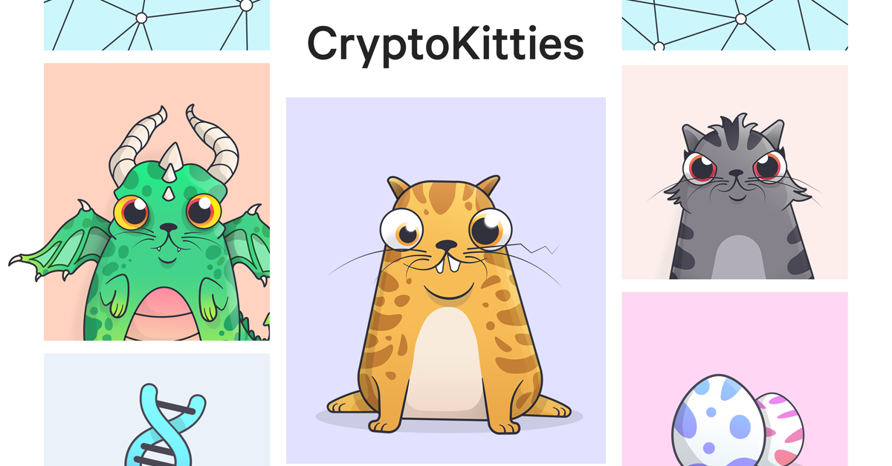

# Advanced Development

## Tools and frameworks

### Truffle

Truffle is development environment, deployment, testing framework for Ethereum blockchain.

* Built-in smart contract compilation, deployment
* Automated contract testing with Mocha and Chai.
* Scriptable deployment & migrations framework.
* Network management for deploying to many public & private networks.
* Interactive console for direct contract communication.
* Instant rebuilding of assets during development.
* External script runner that executes scripts within a Truffle environment.

Truffle can be installed as a node module.

```text
$ npm install -g truffle
```

Quick start

```text
$ truffle init
```

### Few other frameworks

* [Embark](https://github.com/embark-framework/embark) - Framework for DApp development
* [Dapp](https://dapp.tools/dapp/) - Framework for DApp development, successor to DApple
* \*\*\*\*[Drizzle](https://www.trufflesuite.com/drizzle)**:** Collection of front-end libraries for seamless DApp development 
* [Brownie](https://github.com/HyperLink-Technology/brownie) - A python framework for testing, deploying and interacting with Ethereum smart contracts.

### Truffle boxes

[Truffle Boxes](https://www.trufflesuite.com/boxes) are helpful boilerplates that allow you to focus on what makes your DApp unique.

Quick start

```text
$ truffle unbox react
```

### Open Zeppelin

[OpenZeppelin](https://docs.openzeppelin.com/openzeppelin/) allows to create secure smart contracts by following a set of standards. They mainly provide:

* **Contracts** - Set of secure reusable contracts
* **SDK**: Set of tools to develop, test and deploy contracts
* **Starter kits**: Bundles to kick start DApp development

### Ganache 

A personal local blockchain for development purpose that can emulate most of the behavior of Ethereum network. 

## [ERC721](https://github.com/ethereum/EIPs/blob/master/EIPS/eip-721.md) based Crypto collectible

> The “token” is just an entry in the token contract, and who “owns” a token is recorded in the contract. A token is never in “your” wallet

**ERC-20:** is a standard that describes the basic functionalities of a fungible token.

**ERC-721** is a free, open standard that describes how to build non-fungible or unique tokens on the Ethereum blockchain 

Examples: [OpenSea](https://opensea.io/), [CryptoKitties](https://www.cryptokitties.co)




* ERC-20: For money and money-like tokens.
* ERC-721: For things and thing-like tokens


## Smart contract

Import `ERC721Full`

```text
import 'openzeppelin-solidity/contracts/token/ERC721/ERC721Full.sol';
```


Inherit the `ERC721Full`

```text
contract Color is ERC721Full {
constructor() ERC721Full("Color", "COLOR") public {
  }
```

`mint` Function

```text
require(!_colorExists[_color]);
uint _id = colors.push(_color);
_mint(msg.sender, _id);
_colorExists[_color] = true;
```

#### Compile, deploy and test the contract

```text
 $ truffle migrate --network development
```

```text
$ truffle test
```


### Client application \(Truffle + React + Web3.js + MetaMask\) 


**1.Start a private blockchain \(Ganache\).**

```text
 $ ganache-cli --seed amityonline
```

#### 

#### 2. Run the front end React application

```text
 $ cd advanced-development/color-token/
 $ npm install
 $ npm start
```


