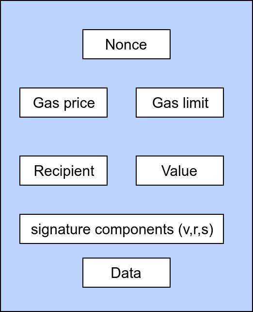

# Ethereum Basics

## Ether currency

Ether \(ETH or Ξ\) is the native cryptocurrency used on the Ethereum network and is used to compensate miners who secure transactions. It could be used as:

* Store of value \(e.g. in lending collateral\)
* A medium of exchange \(e.g. in trade and payments\)

## Addresses and types of accounts

There are two types of accounts in Ethereum.

#### Externally owned account \(EOA\)

The account that is owned by any end user is EOA. Each account will be associated with a key pair \(private and public\). These key pair are often maintained securely in a wallet software.

#### Contract account

Every smart contract code also represented as contract code with its own address. Unlike EOA contract account doesn't have private key. These are executed in EVM. 

Contract accounts can also send and receive ethers.

#### Ethereum addresses

Unique identifiers that represents the user account. They are derived from the public keys or contracts using the hash function \(_`Keccak-256`_\)

​Public key: 

```text
K = 6e145ccef1033dea239875dd00dfb4fee6e3348b84985c92f103444683bae07b83b5c38e5e...
```


```text
Keccak256(K) = 2a5bc342ed616b5ba5732269001d3f1ef827552ae1114027bd3
```

Last 20-byte is the Ethereum address:

```text
0x001d3f1ef827552ae1114027bd3ecf1f086ba0f9
```

## Wallets

In its basic sense, wallet is something manages keys and addresses , tracks and transacts user's money.

But most of the Ethereum wallets are capable fully interacting with smart contracts and Ethereum nodes.

* Ledger Nano S \(Hardware wallet\)
* MetaMask \(Web wallet + DApp Bridge \)
* [MyEtherWallet](https://www.myetherwallet.com/) \(Web + Mobile wallet\)
* TrustWallet \(Mobile wallet\)

## Ethereum clients

Ethereum client is a software that implements Ethereum specification so that they can communicate with any other client in the peer-to-peer network. 

There are several implementations of the Ethereum client specification.

* Parity \(Rust\)
* Geth \(Go\)
* cpp-ethereum \(C++\)
* pyethereum \(Python\)
* Mantis \(Scala\)
* Harmony \(Java\)

Since all the clients follow the same design specifications, they are inter-operable with each other in the network.

[Geth](https://geth.ethereum.org/install-and-build/Installing-Geth) is the most popular Ethereum client implementation.

Running a Geth:

```text
geth --rpc --rpcapi eth,web3,net,personal
```

## Ethereum networks

### Mainnet and testnets

By default every Ethereum node connected to the mainnet. Any client connected to the network with functionality is called fullnode. A mainnet full node is 180 GB \(as of writing\) in size.

Even though mainnet is where all the smart contract reside, testnet is required to test the behavior of contracts.


* Testnet consumes less space and chain syncs faster than the mainnet
* Testnet ether doesn't have real value
* Testnet has less congestion than mainnet


### Working with the private network

Although testnet is a convenient way to test the contract, it is still not a preferred network to test the development code. Setting up a private instance with several or single node is preferred way to test the development contract.

```text
geth --datadir node1/ account new
```

Store the password in `password.txt`

```text
puppeth
```

```text
geth --datadir node1/ init devnet.json
```

```text
geth --datadir node1/ --syncmode 'full' --port 30312 --rpc --rpcaddr 'localhost' --rpcport 8502 --rpcapi 'personal,db,eth,net,web3,txpool,miner' --bootnodes 'enode://3ec4fef2d726c2c01f16f0a0030f15dd5a81e274067af2b2157cafbf76aa79fa9c0be52c6664e80cc5b08162ede53279bd70ee10d024fe86613b0b09e1106c40@127.0.0.1:30310' --networkid 1515 --gasprice '0' --unlock '0x80805177b463B288dE649d94CB70F4779522f119' --allow-insecure-unlock --password password.txt
```


## Transactions

These are signed messages originated by externally owned account and transmitted to the Ethereum network  and finally recorded on the blockchain.


Transactions are the only thing responsible to change the state and execute the smart contracts.





## Smart contracts

Smart contract is an program that is deployed to the Ethereum blockchain and whose functions could be triggered by external users so that it can be executed on Ethereum virtual machines \(EVM\)



## GAS

GAS is fuel for the transactions in Ethereum. It controls the amount of resources that a transaction can use. 

Gas is not equal to Ether. Value of each Gas unit is represented by **gasPrice**. Higher the gasPrice higher the chances of getting included in the block.


gasPrice is measured in gwei. 

* 1 ETH = 10^9 gwei
* 1 gwei = 1 billion wei


The amount of gas units required for each transaction is represented as **gasLimit**. A simple transfer ETH transaction required 21,000 gas units.

## Blockchain and explorers

## EVM


## 

