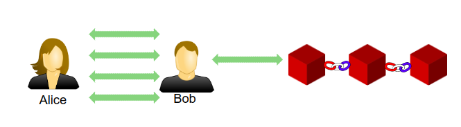

# Scaling Ethereum

Just like Bitcoin or any other public blockchain, Ethereum also suffers from limited scalability of the transactions. Ethereum mainly suffers due to two reasons:

1.  Proof-of-work consensus algorithm which has higher finality \(settlement \) time.
2. High GAS cost for each smart contract interaction.


**In December, 2017, CryptoKitties clogged up Ethereum network due to increased transactions**


There are two layer 2 solutions to solve the scalability issue of Ethereum network - **State channels** and **Side chains**.

## State channels 

Nodes create a channel and perform a series of transactions and commit only the final state to the blockchain

### Raiden Network

*  Raiden Network is an off-chain scaling solution for performing ERC20-compliant token transfers on the Ethereum blockchain
* Ethereum’s version of **Lightning Network**
* Allows unlimited bidirectional transfers with the help of payment channels


Channel is created by locking the tokens into the smart contract


Steps to created a Raiden micro payment:

1. Connect to an Ethereum full node \(Mainnet, Testnet or Private\)
2. Start the Raiden client
3. Register/join Raiden token network
4. Create a channel and deposit token
5. Create a transaction

## Sidechains 

Side chain is a separate chain that is attached to the main chain using two way peg. The side chain mechanism allows asset to be moved between the chains by locking and unlocking those assets.

The sidechain depends on a different consensus mechanism. Consensus algorithms that can achieve the faster transaction finality such as PoA are often preferred. 

### [Loom network](https://loomx.io/developers/en/intro-to-loom.html):

Loom network is the most advanced scaling solution available in production. It helps to scale Ethereum by running a custom blockchan. It has a chain called PlasmaChain that acts as a bridge between several other major blockchains. 

### [Matic network](https://docs.matic.network/):

Matic Network is another  sidechain based scaling solution for public blockchains. It is based on an adapted implementation of Plasma framework.

The existing smart contract can be deployed directly to the Matic side chain without any setup.


Matic testnet RPC url: `https://testnet2.matic.network`


## Ethereum 2.0

