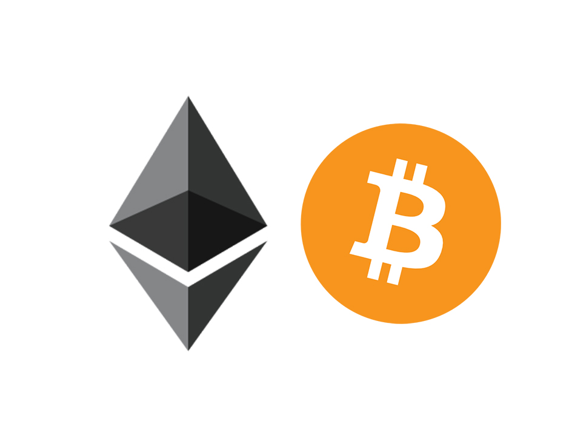

# What is Ethereum?

> Ethereum - "the world computer". It is a deterministic but practically unbounded state machine with a globally accessible singleton state and virtual machine that applies state changes. 
>
>  - [Mastering Ethereum](https://github.com/ethereumbook/ethereumbook)

Just like Bitcoin Ethereum is a decentralized infrastructure but executes and maintains contracts in blockchain.  


Ethereum is currently the [most popular ](https://www.stateofthedapps.com/stats)DApp platform.


## Bitcoin comparison

Although Ethereum is highly influenced by Bitcoin, they have some major differences.


### Similarities

* Peer-to-peer networking, block exchange mechanisms
* Proof-of-work consensus algorithm
* Digital assets
* Use of cryptographic primitives \(Digital signatures, hash functions\)



### Differences

* Ethereum can act as a general purpose computer with smart contracts and virtual machine \(EVM\) - Turing complete
* Ethereum is not just a payment network
* Ethereum doesn't use UTXO model to keep track of payments. Instead maintains the account information in state.


## History

As Bitcoin's popularity grew people saw the potential of decentralization beyond money. Building upon Bitcoin proved difficult due its self imposed limitations. 

* During 2013, Vitalik Buterin, a Bitcoin enthusiast proposed enhancement to Bitcoin and Mastercoin. Her later proposed alternated language to Mastercoin. But it wasn't adopted by the team.
* In December 2013, Vitalik published the whitepaper for Ethereum: turing complete blockchain.
* Later Vitalik along with Gavin Wood and Joseph Lubin started working the implementation until 2015.


First ever block of Ethereum blockchain was mined on July 30, 2015. 


## Stages of development and current status

There are four planned milestones in the development. Each of these stages are hard forks \(meaning the new chain is not backward compatible\).

There are several intermediate hard forks that have occurred.

* **Frontier** \(July 2015\)
* **Homestead**  \(March 2016\)
* **Metropolis** \(Feb 2019, Constantinople\)
* Serenity

## Ethereum components

* **P2P network**: Runs on protocol called DEVp2p.
* **Consensus mechanism**: Uses Ethash \(Proof-of-work based\)
* **State machine**: The state of the Ethereum is modified by the transactions that are processed by Ethereum virtual machine \(EVM\). The state is stored in a data structure called Merkle Patricia tree.

## Ethereum and Cryptography

* Hash function - Keccak-256
* Digital signature - ECDSA \(Elliptic Curve Digital Signature Algorithm\)
* Key generation - ECC \(Elliptic Curve Cryptography \)

## Turing completeness of Ethereum 

